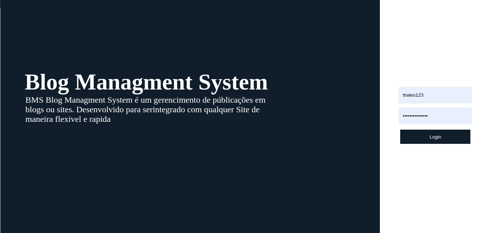
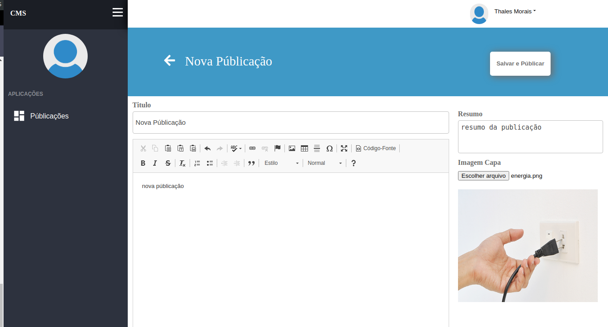
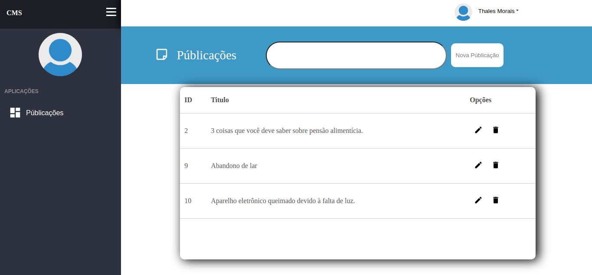

<h1 align="center">
    
      
</h1>

Este é um dashboard público utilizado para cadastro de públicações afim de ser utilizado em sites no formato blog, ele contempla um template básico assim com menus para inclusão, edição, exclusão de públicações

  

  

---

## Sumario

<ul>
  <li><a href="#-ponto-de-partida">Ponto de Partida</a></li>
  <li><a href="#-funcionalidades-do-aplicativo">Funcionaldiades do Aplicativo</a></li>
  <li><a href="#-funcionalidades-do-aplicativo">Tecnologias</a></li>
  <li><a href="#Screenshots">Screenshots</a></li>
</ul>

---

## 🚀 Ponto de Partida
Para rodar esteprojeto em seu computador, instale o node e o react após eles instalados, execute o comando `npm install` para instalar todas as dependências do projeto e posteriormente executar o comando `npm start` para rodar a aplicação

Se quiser executar e testar as funcionalidades da aplicações, baixe o projeto da API no link <a href="https://github.com/Thalesmoraisdealmeida21/cms_api">https://github.com/Thalesmoraisdealmeida21/cms_api<a/> e execute ele em seu computado, seguindo os passos contido no readme do repositório. 
  
Após configurado a API abra o projeto do dashboard e crie um arquivo .env com a diretriz `REACT_APP_API_URL=ENDEREÇO DA API` lembrando de substituir para o endereço a onde está rodando a API que você configurou

## 📋 Funcionalidades do Aplicativo
Estas são as funcionalidades da aplicação

 - [x] Criação de Públicações
 - [x] Exclusão de Públicação
 - [x] Edição da Públicação
 - [x] Upload de imagem
 - [x] Autenticação JWT
 

### Tecnologias
Fo utilizado para a criação deste projeto o framework react e todas as interfaces foram inteiramente constrúidas com CSS e HTML

---
## Screenshots
---

    
    
    

